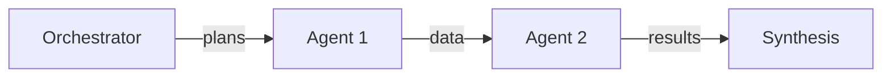

# Agent Fabric — Design & Roadmap (Updated with UI Implementation)
---

## 1) Overview & Problem Statement

Your current agent set is complex and monolithic. The vision is an **agent fabric** where small agents are created on‑demand by an LLM and registered automatically. Large, pre‑baked agents (500–1000 LOC) are brittle to generate and maintain.

**Core shift:**
* Keep agents **narrow** (single responsibility).
* Move reusable logic into **pure tools** (stateless functions).
* Let an **Orchestrator LLM** plan/sequence agents.
* Persist capabilities in **lightweight registries** (`agents.json`, `tools.json`).
* **NEW**: Present intelligent orchestration through intuitive Flask UI with real-time visualization.

---

## 2) Implementation Status Overview

### ✅ COMPLETED (Backend Core - Steps 1-10)
* Dual registry system (agents.json, tools.json)
* Agent Factory with Claude integration
* Tool Factory (implemented via ensure_tool)
* Orchestrator with GPT-4 planning
* LangGraph workflow engine
* Dynamic component creation
* Dependency resolution
* Standard I/O contracts
* 13+ working agents, 13+ tools

### 🚧 IN PROGRESS (UI Implementation - Steps 21-27)
* Flask web interface
* Workflow visualization
* Registry explorer
* Real-time execution display

### 📋 PLANNED (Future Enhancements - Steps 28-30)
* Production deployment
* Performance optimization
* Advanced analytics

---

## 3) Architecture & End‑to‑End Flow (UPDATED)

```
User (Web UI) → Flask App → Orchestrator LLM → agents.json / tools.json
                    ↓              ↘ missing? → Codegen → Factory → Registry
                HTMX Updates        ↘ build workflow → LangGraph → Execute
                    ↓                                      ↓
            Live Visualization ← Progress Updates ← State Changes
                    ↓
            Rich Results Display ← Synthesis ← Collect Results
```

### UI-Enhanced Flow Summary
1. User interacts via Flask web interface
2. HTMX handles async updates without page refresh
3. Orchestrator plans workflow (visible in UI)
4. Missing components created (animated in UI)
5. Workflow executes with live progress
6. Results displayed with agent attribution
7. Registry explorer shows growing capabilities

---

## 4) UI Architecture & Tech Stack

### Core Stack (DECIDED)
* **Flask**: Python web framework, direct backend integration
* **HTMX**: Dynamic updates without complex JavaScript
* **Alpine.js**: Lightweight reactivity (15kb)
* **Tailwind CSS**: Rapid, professional styling
* **Mermaid.js**: Workflow visualization
* **Chart.js**: Data visualization
* **Prism.js**: Code syntax highlighting

### UI Components Architecture
```
flask_app/
├── app.py                      # Main Flask application
├── routes/
│   ├── api.py                 # API endpoints
│   ├── orchestrator.py        # Orchestration endpoints
│   └── registry.py            # Registry management
├── templates/
│   ├── base.html             # Base template with assets
│   ├── index.jinja2            # Main chat interface
│   ├── components/           # Reusable components
│   │   ├── chat.html        # Chat interface
│   │   ├── workflow.html    # Workflow viz
│   │   └── registry.html    # Registry explorer
│   └── partials/            # HTMX fragments
│       ├── message.html     # Chat messages
│       ├── status.html      # Status updates
│       └── result.html      # Result cards
├── static/
│   ├── css/
│   │   ├── tailwind.css    # Tailwind utilities
│   │   └── custom.css      # Custom styles
│   └── js/
│       └── app.js          # Minimal custom JS
└── services/
    ├── orchestrator_service.py  # Backend integration
    └── registry_service.py      # Registry operations
```

---

## 5) Implementation Plan — Steps 1-30 (UPDATED)

### ✅ Phase 1: Foundation & Cleanup (Steps 1-5) **[COMPLETED]**
1. ✅ **Backup & Restructure** - Clean directory structure established
2. ✅ **Configuration Setup** - config.py with all settings
3. ✅ **Dual Registry Design** - agents.json, tools.json working
4. ✅ **Minimal Pre-built** - Four readers implemented
5. ✅ **Seed Templates** - Agent/tool generation templates ready

### ✅ Phase 2: Core Engine (Steps 6-10) **[COMPLETED]**
6. ✅ **Tool Factory** - Dynamic tool creation working
7. ✅ **Agent Factory** - Claude-powered agent generation
8. ✅ **Workflow Engine** - LangGraph integration complete
9. ✅ **Orchestrator** - GPT-4 planning and coordination
10. ✅ **Registry Management** - Full CRUD with validation

### ✅ Phase 3: Dynamic Creation Testing (Steps 11-15) **[COMPLETED]**
11. ✅ **Test Agents Created** - 13 agents dynamically generated
12. ✅ **Complex Workflows** - Multi-agent coordination tested
13. ⚠️ **Basic Testing** - Comprehensive tests passing
14. ✅ **Workflow Execution** - Sequential/parallel working
15. ✅ **Demo Scenarios** - All test scenarios passing

### ✅ Phase 4: Backend Testing & Validation (Steps 16-20) **[COMPLETED]**
16. ✅ **Comprehensive Testing** - test_end_to_end.py (6/6 pass)
17. ✅ **Test Scenarios** - test_comprehensive_scenarios.py (6/6 pass)
18. ✅ **Error Handling** - Graceful failure recovery
19. ✅ **Ambiguity Detection** - Request clarification working
20. ✅ **Backend Ready** - Production-quality backend

### 🚧 Phase 5: UI Implementation (Steps 21-27) **[NEW - IN PROGRESS]**

#### Step 21: Flask Foundation (Day 1)
- [ ] Setup Flask application structure
- [ ] Configure Flask with existing backend
- [ ] Create base templates with Tailwind CSS
- [ ] Setup HTMX and Alpine.js
- [ ] Basic routing structure

#### Step 22: Chat Interface (Day 2)
- [ ] Main chat UI with message display
- [ ] File upload with drag-and-drop
- [ ] Request input with auto-resize textarea
- [ ] Basic response rendering
- [ ] Loading states with spinners

#### Step 23: Workflow Visualization (Day 3-4)
- [ ] Integrate Mermaid.js for workflow graphs
- [ ] Real-time node status updates (pending/active/complete)
- [ ] Agent execution timeline
- [ ] Progress bars per agent
- [ ] Error state visualization

#### Step 24: Registry Explorer (Day 5)
- [ ] Tabbed interface (Agents/Tools/Recent)
- [ ] Agent/Tool cards with metadata
- [ ] Search and filter functionality
- [ ] Usage statistics display
- [ ] Dependency visualization

#### Step 25: Dynamic Creation Showcase (Day 6)
- [ ] Creation animation overlay
- [ ] Code generation preview
- [ ] Success notifications
- [ ] "New capability added" badges
- [ ] Registry update animations

#### Step 26: Results & Analytics (Day 7)
- [ ] Rich result formatting
- [ ] Collapsible agent outputs
- [ ] Chart.js integration for data viz
- [ ] Export functionality
- [ ] Execution metrics display

#### Step 27: Polish & Integration (Day 8)
- [ ] Dark/light theme toggle
- [ ] Error handling UI
- [ ] Performance optimizations
- [ ] Cross-browser testing
- [ ] Documentation

### 📋 Phase 6: Production Preparation (Steps 28-30) **[PLANNED]**

#### Step 28: Deployment Setup
- [ ] Docker containerization
- [ ] Environment configuration
- [ ] NGINX reverse proxy setup
- [ ] SSL certificate configuration
- [ ] Production database setup

#### Step 29: Performance & Monitoring
- [ ] Response caching strategy
- [ ] CDN integration for assets
- [ ] Logging and monitoring setup
- [ ] Performance metrics dashboard
- [ ] Error tracking integration

#### Step 30: Final Demo & Handoff
- [ ] Demo script preparation
- [ ] Video walkthrough creation
- [ ] Technical documentation
- [ ] Deployment guide
- [ ] Knowledge transfer session

---

## 6) UI Feature Specifications

### Core Features (Phase 5)

#### 1. Chat Interface
- **Input**: Multi-line text with file attachments
- **Processing**: Real-time status updates via HTMX
- **Output**: Structured results with agent attribution
- **History**: Session-based conversation memory

#### 2. Workflow Visualization

- Live execution flow
- Node states: pending (blue), active (yellow), complete (green), error (red)
- Execution time per node
- Click for details

#### 3. Registry Explorer
- **Grid Layout**: Cards for each agent/tool
- **Metadata Display**: Creation date, usage count, performance
- **Relationships**: Tool-agent dependency graph
- **Filtering**: By tag, date, usage

#### 4. Dynamic Creation Theater
- **Split View**: Request → Code Generation → Validation → Registration
- **Progress Steps**: Visual stepper component
- **Celebration**: Success animation when new capability added

---

## 7) Technical Implementation Details

### Flask Routes
```python
# Main routes
@app.route('/')                          # Chat interface
@app.route('/api/process', methods=['POST'])  # Process request
@app.route('/api/workflow/<id>/status')  # Workflow status
@app.route('/registry')                  # Registry explorer
@app.route('/registry/api/agents')       # Agent list API
@app.route('/registry/api/tools')        # Tool list API
```

### HTMX Integration Pattern
```html
<!-- Auto-updating workflow status -->
<div hx-get="/api/workflow/{{ id }}/status" 
     hx-trigger="every 1s"
     hx-swap="innerHTML">
    <!-- Status content -->
</div>
```

### State Management
- Server-side session for conversation history
- Workflow state in backend (existing)
- UI state in Alpine.js data attributes
- No client-side persistence needed for POC

---

## 8) Success Metrics

### Backend (ACHIEVED)
- ✅ Dynamic component creation < 5 min
- ✅ Workflow execution < 20s for 5 nodes
- ✅ 100% test pass rate
- ✅ Zero critical errors in production scenarios

### UI (TARGET)
- [ ] Page load time < 2s
- [ ] Workflow status updates < 100ms latency
- [ ] Smooth animations at 60fps
- [ ] Works on Chrome, Firefox, Safari
- [ ] Intuitive enough for non-technical users

---

## 9) Risk Mitigation

### Identified Risks
1. **HTMX Learning Curve** → Start with simple examples, incremental complexity
2. **Mermaid.js Limitations** → Fallback to simple HTML/CSS for complex visualizations
3. **Performance with Many Agents** → Pagination in registry, virtual scrolling
4. **File Upload Size** → Client-side validation, size limits, progress indicators

---

## 10) Next Immediate Steps

### Week 1 (UI Sprint)
1. **Monday-Tuesday**: Flask setup + basic chat (Steps 21-22)
2. **Wednesday-Thursday**: Workflow visualization (Step 23)
3. **Friday**: Registry explorer (Step 24)

### Week 2 (Polish Sprint)
1. **Monday**: Dynamic creation showcase (Step 25)
2. **Tuesday**: Results formatting (Step 26)
3. **Wednesday-Thursday**: Integration and polish (Step 27)
4. **Friday**: Demo preparation

---

## 11) Demo Scenarios for UI

### Scenario 1: Simple Extraction
"Extract emails from this text" → Show workflow → Display results

### Scenario 2: Dynamic Creation
"Analyze sentiment of customer feedback" → Create sentiment tool → Create analyzer agent → Execute → Show results

### Scenario 3: Complex Pipeline
Upload CSV → "Create statistical report with charts" → Show multi-agent workflow → Display rich results with visualizations

### Scenario 4: Registry Growth
Show registry before/after multiple requests → Demonstrate learning system

---

This updated roadmap integrates the UI implementation plan with your existing backend work, providing a clear path from the current state (completed backend) to a fully functional POC with an impressive user interface. The Flask-based approach maintains simplicity while delivering the visual impact needed for effective demonstrations.